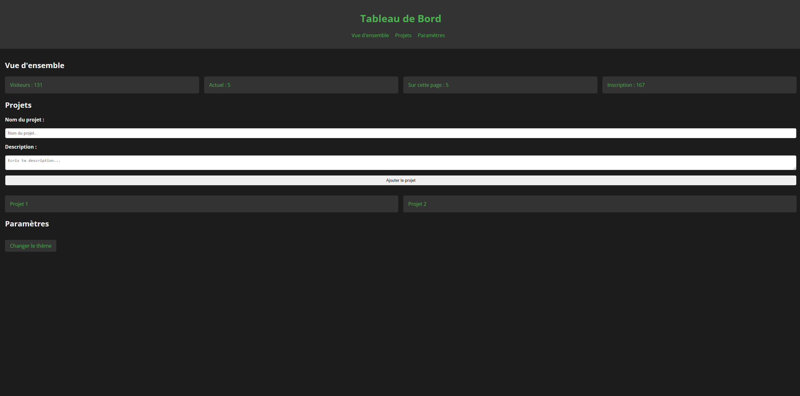

### Projet : Tableau de Bord Interactif pour une Application de Gestion de Projets

#### Fonctionnalités principales :

1. **Interface utilisateur responsive** : Utilisation des media queries pour s'assurer que le tableau de bord est accessible et esthétique sur tous les appareils (mobiles, tablettes, desktops).
2. **Grilles CSS** : Mise en place d'une mise en page complexe avec CSS Grid pour organiser les différentes sections du tableau de bord.
3. **Flexbox** : Utilisation de Flexbox pour la mise en page de composants individuels.
4. **Animations et transitions** : Ajout d'animations et de transitions pour améliorer l'expérience utilisateur.
5. **Formulaires et validations** : Création de formulaires interactifs avec des validations en temps réel.
6. **Utilisation avancée des pseudo-éléments et classes** : Stylisation complexe des éléments en utilisant `::before`, `::after`, `:nth-child()`, etc.
7. **Thèmes dynamiques** : Implémentation d'un mode clair/sombre avec CSS variables.

